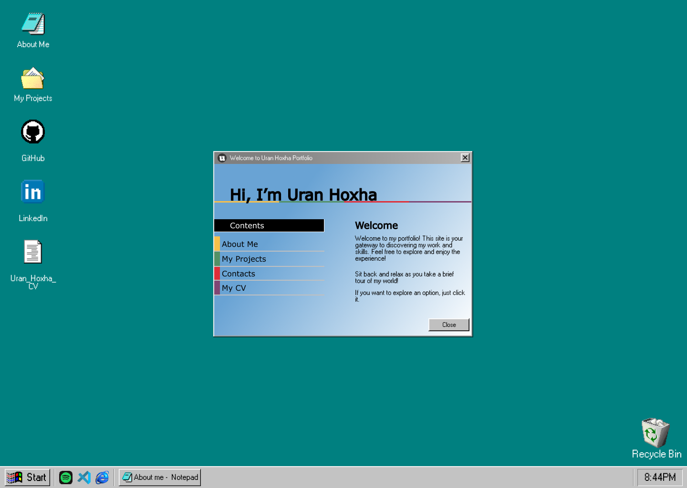

<!DOCTYPE html>
<html lang="en">
<head>
  <meta charset="UTF-8">
  <meta name="viewport" content="width=device-width, initial-scale=1.0">
  <title>My Personal Portfolio</title>
  
</head>
<body>
  <h1>Personal Portfolio: Inspired by Windows 98 Design</h1>
  <h4>
    Everything here is coded by me, except for the dragging functionality. 
    For that, I used <a href="https://www.npmjs.com/package/react-draggable?activeTab=readme#draggable-usage" 
    target="_blank" rel="noreferrer">react-draggable</a>. All other styles and features were built from scratch!
  </h4>

  <h3>Note:</h3>
  

    Some features may not function optimally on smaller screen sizes. I'm actively working on improvements!
  

  <h2>Check out my live portfolio:</h2>
  <a href="https://your-portfolio-link.netlify.app/" target="_blank">
    https://your-portfolio-link.netlify.app/
  </a>

  <h3>Technologies Used:</h3>
  

    
    
    <!-- Add more technology icons here if needed -->
  

  

    <h3>Preview:</h3>
    
  

</body>
</html>

